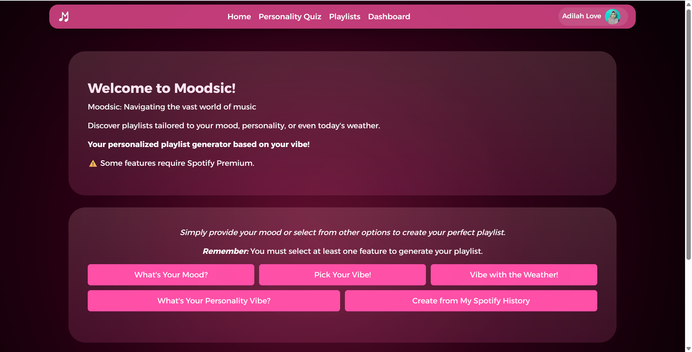
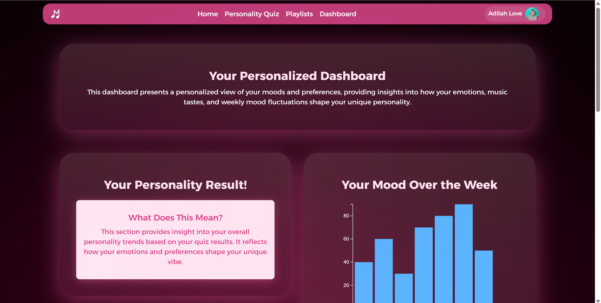

# 🏫 IS216 Web Application Development II

---

## Section & Group Number
G4 Group 15 

## Website Link
http://moodsic-three.vercel.app

Without Spotify premium, the following will not work: 
1) Use My Spotify Learning History
2) Preview Function during Playlist Generation

Spotify Account (Non-premium account)

Username: 31frrdydgtfe6p2z6v6nbtctq4ci

Login with password: testing123#

## Use of AI/LLMs
| Task | Yes/No | Description |
|:--|:--|:--|
| Information search | Yes | Used to gather additional ideas and explore potential features we could implement in our website. |
| Generating website concepts, layouts, or themes | No | Our concepts, layouts, and themes were planned beforehand, and we developed the website based on our own initial design direction. |
| Exploring UI/UX design inspirations | Yes | Used to explore styling variations and gain inspiration to make the website more visually appealing and engaging. |
| Explaining coding errors / debugging hints | Yes | Helpful when debugging became challenging or when certain issues were hard to identify manually. |
| Boilerplate code generation | Yes | - |
| Generating unit tests, sample inputs, or mock data | No | - |
| Core implementation tasks | No | Some references and small hints were taken from the web or LLMs, but implementation was primarily done by us. |
| Major business logic, backend endpoints, or critical frontend interactivity | Yes | Supported us in understanding complex logic or structuring certain components, but final implementation was still done manually. |
| Solving significant implementation issues | Yes | Used to help identify the root cause of problems, though all fixes were applied manually by the team. |

---

## Acknowledgments
This project uses **face-api.js** (by justadudewhohacks) for face detection and recognition.  
The pre-trained model weights (e.g. SSD Mobilenet, face landmarks, recognition etc.) are used under the MIT license. :contentReference[oaicite:0]{index=0}  

- Repository: https://github.com/justadudewhohacks/face-api.js  
- License: MIT :contentReference[oaicite:1]{index=1}

---

## Group Members

| Photo | Full Name | Role / Features Responsible For |
|:--:|:--|:--|
|  | Siti Adilah Binte Selamat | Frontend Developer - Weather API Development, Chart for results |
|  | Ei Ngon Phoo Pwint | Backend Developer - Spotify API Integration & Login |
|  | Aaliya Navas | Backend Developer - Database & Authentication, Vercel Integration |
|  | Sreya Mohan Doss | Frontend Developer – Word Cloud Interaction |
|  | Kushala Kanakesh | Frontend Developer - UI/UX Designer, Song Of The Day |
|  | Etienne Wong Ai Ting | Frontend Developer - Personality Quiz Development |


<!-- > Place all headshot thumbnails in the `/photos` folder (JPEG or PNG). -->

---

## Business Problem

Describe the **real-world business or community problem** your project addresses.

<!-- > *Example:*   -->
> Navigating the vast world of music to find a playlist that matches our exact mood can be a surprisingly frustrating chore. The paradox of choice on platforms like Spotify often leads to decision fatigue, pulling us out of the moment instead of enhancing it. 

> Moodsic is an interactive web application designed to solve this. It intelligently matches the users’ current mood, personality traits, and even the weather to personalized playlists by analyzing a unique blend of inputs. By removing the burden of choice, Moodsic creates a more intuitive, enjoyable, and emotionally-connected music listening experience.

---

## Web Solution Overview

### 🎯 Intended Users
Identify your target user groups.
 Spotify Users mainly gen-z 

### 💡 What Users Can Do & Benefits
Explain the core features and the benefit each provides.  

| Feature | Description | User Benefit |
|:--|:--|:--|
| Register & Login | Secure authentication system | Personalized experience and data security |
| Mood Input | Users can input their mood by selecting from a word cloud, and use data like weather and Spotify history to enhance the mood input. | Creates personalized playlists based on mood and external factors. |
| Personality Quiz | An engaging personality quiz that determines user preferences, further customizing their experience. | Helps generate a playlist based on the user's personality traits |
| Dashboard | Displays a personalized view of user moods, quiz results, and preferences. | Allows users to track how their moods and quiz results impact their playlist and improve the music experience. |

---

## Tech Stack

| Logo | Technology | Purpose / Usage |
|:--:|:--|:--|
|  | **HTML5** | Structure and content |
|  | **CSS3 / Bootstrap** | Styling and responsiveness |
|  | **JavaScript (ES6)** | Client-side logic and interactivity |
|  | **React.js** | Building user interfaces with components |
|  | **D3.js** | Data visualisation |
|  | **Chart.js / react-chartjs-2** | Mood chart |
| | **Framer Motion** |  Animations |
| | **Node.js + Express.js** | Organize the backend routes and logic efficiently |
| | **Vercel** |  Website Hosting |
|  | **NeonDb** | Authentication and database services |
|  | **Spotify for Developers API** | Spotify API |
|  | **OpenWeatherMap API** | Weather API |
|  | **Google GenAI API** | Generating vibe phrases |

---

## Use Case & User Journey

Provide screenshots and captions showing how users interact with your app.

1. **Landing Page & Spotify Login**  
     
   
   - The landing page displays the main entry point to the app, where users can log in using their Spotify credentials. It provides a welcoming introduction to the personalized music experience.

2. **Mood Input**  
    
    
    
     
   - Users are prompted to choose their mood by selecting from a word cloud, vinyl and a facial mood detector. This input helps generate a playlist based on their current emotional state, with additional options like weather and Spotify history.


3. **Playlist Generation**
<br>
   
   - A playlist of 15 songs pop up based on their mood, weather and/or past Spotify listening history.

4. **User Dashboard**  
    
   - The user dashboard provides a personalized view of the user's moods and preferences. It includes a breakdown of their music tastes, mood fluctuations, and the impact of those moods on the playlists generated.

5. **Personality Quiz**  
   
     
   - The personality quiz helps users discover how their personality influences their music preferences. This fun and engaging activity contributes to generating a more accurate playlist tailored to their unique traits.

> Save screenshots inside `/screenshots` with clear filenames.

---

## Developers Setup Guide

Comprehensive steps to help other developers or evaluators run and test your project.

---

moodsic/
├── legacy           ← old HTML/CSS/JS here
├── frontend/        ← React app (with navbar, stats, moods, etc.)
├── backend/         ← Node/Express app (with .env ignored)
└── README.md

### 0) Prerequisites
- [Git](https://git-scm.com/) v2.4+  
- [Node.js](https://nodejs.org/) v18+ and npm v9+  
- Access to backend or cloud services used (Firebase, Spotify for Developers, Google AI Studio)

---

### 1) Download the Project
```bash
git clone https://github.com/Adilah09/Moodsic.git
cd Adilah09/Moodsic
npm install
```

---

### 2) Configure Environment Variables
Create a `.env` file in the backend folder with the following structure:

```bash
SPOTIFY_CLIENT_ID=<your_spotify_client_id>
SPOTIFY_CLIENT_SECRET=<your_spotify_client_secret>
REDIRECT_URI= <http://localhost:8888/callback>
FRONTEND_URI= <http://localhost:3000>
WEATHER_API_KEY=<your_weather_api_key>
GEMINI_API_KEY=<your_gemini_api_key>
```

> Never commit the `.env` file to your repository.  
> Instead, include a `.env.example` file with placeholder values.

---

### 3) Backend

1. Start the backend:
   ```bash
   cd backend
   npm install
   npm start
   ```

---

### 4) Run the Frontend
To start the development server:
```bash
cd frontend
npm install
npm start
```
The project will run on [http://localhost:3000](http://localhost:3000) by default.

---

### 5) Testing the Application

#### Manual Testing
Perform the following checks before submission:

| Area | Test Description | Expected Outcome |
|:--|:--|:--|
| Authentication | Register, Login, Logout | User successfully signs in/out |
| CRUD Operations | Add, Edit, Delete data | Database updates correctly |
| Responsiveness | Test on mobile & desktop | Layout adjusts without distortion |
| Navigation | All menu links functional | Pages route correctly |
| Error Handling | Invalid inputs or missing data | User-friendly error messages displayed |

---

### 6) Common Issues & Fixes

| Issue | Cause | Fix |
|:--|:--|:--|
| `Module not found` | Missing dependencies | Run `npm install 'that missing dependency'` |
| `CORS policy error` | Backend not allowing requests | Enable your domain in CORS settings |

---

## Group Reflection

Each member should contribute 2–3 sentences on their learning and project experience.

> - Adilah: This project has challenged my coding and teamwork skills while introducing me to new technologies that make websites visually engaging. Creating charts was a new experience for me, and I quickly learned how important it is to balance technical implementation with clear and appealing design. Collaborating with my team enhanced my communication and time management abilities, as we combined our strengths to bring the project to life. Overall, I’m proud of what we accomplished and excited to continue improving my development skills. 

> - Eryn: I gained practical experience working with real-world frameworks and authentication systems. I discovered how APIs function in production settings, including the challenges of permissions and paid access. One major challenge was handling Spotify’s authentication and token flow, which I resolved through documentation study and iterative testing. Collaborating closely with the frontend team improved my communication and project management skills, while reinforcing the importance of structured problem-solving and teamwork in a development environment.

> - Aaliya: Developing the backend for Moodsic using Express.js and PostgreSQL (Neon) has been a great learning experience. It taught me how to handle authentication, data storage and server-side logic efficiently. Deploying it on Vercel gave me a better understanding of full-stack integration, API routing and connecting cloud databases to web apps. Overall, it deepened my knowledge of backend architecture and how to scale web applications smoothly.

> - Sreya: By sharing my word cloud designs with my group mates and getting their feedback, I could design the word cloud feature so that it matched the theme of the application better, and make it more usable for the users as well. I also explored different libraries like D3.js and other frameworks like Tailwind. Although I did not use them, it was a good opportunity to learn about the available resources. All in all, this learning experience has definitely been valuable, and has reinforced my learning in this module.

> - Kushala: As the Frontend Developer and UI/UX Designer for Moodsic, I learned how to transform creative ideas into interactive, user-friendly interfaces that seamlessly blend emotion and music. Building features like Song of the Day taught me how to balance aesthetics with usability, making every click and effect feel intentional. Through continuous testing and feedback, I strengthened my skills in visual design and user-centered thinking. It was very rewarding seeing our vision come to life.

> - Etienne: Managing to complete the personality quiz using HTML and JavaScript was a rewarding challenge, as I had to ensure it was both interactive and user-friendly. Converting it to React.js afterward was an exciting next step, as it allowed me to leverage components and state management for a more dynamic and maintainable application. This experience deepened my understanding of front-end development and the power of React in building scalable web applications.
 

As a team, reflect on:
- Key takeaways from working with real-world frameworks  
- Challenges faced and how they were resolved  
- Insights on teamwork, project management, and problem-solving 

> - As a team, working with real-world frameworks like React, Vercel and Chart.js gave us valuable hands-on experience in building a functional and interactive website. We quickly learned the importance of choosing the right framework for each task—for example, using React for state management and Vercel for backend services. These frameworks streamlined our workflow and kept the code organized, making it easier to scale and maintain the project as it grew. A key takeaway was realizing how powerful and time-saving these tools can be when used effectively, but also how they require a strong understanding of their core concepts to prevent issues in the long run.

> - Throughout the project, we encountered challenges such as integrating multiple libraries, managing complex states, and ensuring cross-component compatibility. These were resolved through strong communication and collaborative problem-solving. For example, we divided tasks effectively and regularly checked in with each other to ensure we were aligned. In terms of teamwork, we learned the value of trust and constructive feedback, with everyone contributing their strengths and being open to suggestions. Project management skills were crucial in keeping us on track, with clear deadlines and responsibility sharing helping us stay organized and meet milestones.
